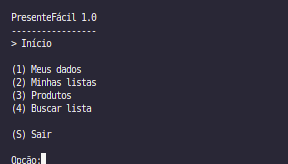

# Relatório do Trabalho Prático - Presentefacil

## Participantes
- Caio Fernandes da Silva
- Gustavo Lopes Oliveira
- Heitor Canhestro Vieira Moreira
- Lucas Soares Tavares

## Descrição Completa do Sistema

O Presentefacil é um sistema para gerenciamento de listas de presentes, voltado para facilitar a organização de eventos como aniversários, casamentos e confraternizações. Usuários podem criar, editar, consultar e excluir suas listas de presentes, além de compartilhar listas com outras pessoas por meio de um código NanoID, garantindo privacidade e praticidade. O sistema permite também visualizar listas de terceiros sem expor dados sensíveis, promovendo colaboração entre participantes de um evento.

## Telas do Sistema

O sistema conta com uma interface intuitiva, composta pelas seguintes telas principais:

- **Menu Principal:**  
  

- **Tela de Dados do Usuário:**  
  

- **Tela de Listas de Presentes:**  
  

- **Dados das listas:**  
  

- **Tela de Compartilhamento por NanoID:**  
  

## Classes Criadas

O projeto foi estruturado em diversas classes para garantir modularidade e organização. As principais são:

- `Usuario` (modela o usuário do sistema)
- `ListaPresente` (modela a lista de presentes)
- `ArquivoIndexado` (classe base para persistência e indexação)
- `TabelaHashExtensivel` (implementa índice direto e indireto)
- `ArvoreBMais` (implementa índice para relacionamento 1:N)
- `NanoID` (gera códigos únicos para compartilhamento)
- `SistemaPresentefacil` (classe principal do sistema)

## Operações Especiais Implementadas

- **CRUD completo para usuários e listas:**  
  Ambas as entidades estendem `ArquivoIndexado`, garantindo persistência eficiente e operações de consulta, edição, exclusão e cadastro.

- **Índices diretos e indiretos:**  
  Utilização de Tabelas Hash Extensíveis e Árvores B+ para otimizar buscas e garantir integridade dos dados.

- **Relacionamento 1:N entre usuários e listas:**  
  Registrado e consultado via Árvore B+, permitindo que cada usuário possua múltiplas listas vinculadas pelo campo `idUsuario`.

- **Compartilhamento seguro de listas via NanoID:**  
  Permite que listas sejam compartilhadas sem expor dados sensíveis, utilizando códigos únicos gerados pela classe `NanoID`.

- **Visualização de listas de terceiros:**  
  Usuários podem acessar listas de outros participantes por meio do código NanoID, sem acesso a informações privadas.

- **Soft Delete:**
  A função de exclusão foi implementada utilizando o conceito de Soft Delete, onde os registros são marcados com uma lápide em vez de serem removidos fisicamente dos arquivos. Isso permite preservar o histórico dos dados e facilita eventuais recuperações ou auditorias, sem comprometer a integridade do sistema.

## Checklist

- **Há um CRUD de usuários (que estende a classe ArquivoIndexado, acrescentando Tabelas Hash Extensíveis e Árvores B+ como índices diretos e indiretos conforme necessidade) que funciona corretamente?**  
  Sim. O CRUD de usuários foi implementado conforme especificado, utilizando índices para otimizar buscas e garantir integridade.

- **Há um CRUD de listas (que estende a classe ArquivoIndexado, acrescentando Tabelas Hash Extensíveis e Árvores B+ como índices diretos e indiretos conforme necessidade) que funciona corretamente?**  
  Sim. O CRUD de listas está funcional e utiliza os índices para garantir eficiência e integridade.

- **As listas de presentes estão vinculadas aos usuários usando o idUsuario como chave estrangeira?**  
  Sim. Cada lista possui o campo `idUsuario` como chave estrangeira, garantindo o vínculo correto.

- **Há uma árvore B+ que registre o relacionamento 1:N entre usuários e listas?**  
  Sim. O relacionamento é registrado e consultado via Árvore B+, permitindo múltiplas listas por usuário.

- **Há uma visualização das listas de outras pessoas por meio de um código NanoID?**  
  Sim. O sistema permite visualizar listas de terceiros usando NanoID, sem expor dados sensíveis.

- **O trabalho compila corretamente?**  
  Sim. O projeto compila sem erros.

- **O trabalho está completo e funcionando sem erros de execução?**  
  Sim. Todas as funcionalidades foram testadas e estão operacionais.

- **O trabalho é original e não a cópia de um trabalho de outro grupo?**  
  Sim. O trabalho é original, desenvolvido integralmente pelo grupo.
