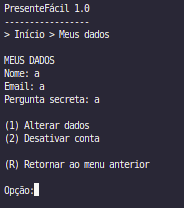
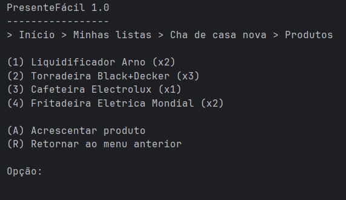

# Relatório do Trabalho Prático - Presentefacil

## Participantes
- Caio Fernandes da Silva
- Gustavo Lopes Oliveira
- Heitor Canhestro Vieira Moreira
- Lucas Soares Tavares

## Descrição Completa do Sistema

O Presentefacil é um sistema para gerenciamento de listas de presentes, voltado para facilitar a organização de eventos como aniversários, casamentos e confraternizações. Usuários podem criar, editar, consultar e excluir suas listas de presentes, além de compartilhar listas com outras pessoas por meio de um código NanoID, garantindo privacidade e praticidade. O sistema permite também visualizar listas de terceiros sem expor dados sensíveis, promovendo colaboração entre participantes de um evento.

## Telas do Sistema

O sistema conta com uma interface intuitiva, composta pelas seguintes telas principais:

- **Menu Principal:**  
  

- **Tela de Dados do Usuário:**  
  

- **Tela de Listas de Presentes:**  
  

- **Dados das listas:**  
  

- **Tela de Compartilhamento por NanoID:**  
  

---
### TP2 

- **Tela de Produtos:**  
  

- **Tela de Dados de Produtos:**  
  

- **Tela de Produtos inseridos na lista:**  
  

- **Tela de Dados dos Produtos inseridos na lista:**  
  
---
### TP3
- **Tela de busca por nome de produto**  
  

- **Tela de busca por nome para adicionar produto**  
  

---
### TP4

Para explorar nossa aplicação para visualizar as operações do CRUD em um arquivo, basta entrar pela sua máquina e acessar este link: https://heitor582.github.io/tp-aeds3-presentefacil/

Foi realizada uma avaliação de utilidade e usabilidade da aplicação com usuários, utilizando a escala Likert de 1 a 5, onde 1 significa "Discordo totalmente" e 5 significa "Concordo totalmente". Abaixo, a tabela apresenta os resultados obtidos:

``` 
| Item | Afirmação resumida                         | Média das respostas |
| :--: | :----------------------------------------: | :-----------------: |
| 1    | Compreensão de armazenamento de dados      | 4.8                 |
| 2    | Facilidade com JSON                        | 4.5                 |
| 3    | Entendimento de binário/baixo nível        | 4.6                 |
| 4    | Relação operações/armazenamento            | 4.6                 |
| 5    | Apoio ao aprendizado (estruturas/arquivos) | 4.7                 |
| 6    | Facilidade das funções principais          | 4.7                 |
| 7    | Interface intuitiva                        | 4.8                 |
| 8    | Clareza de mensagens/alertas               | 4.7                 |
| 9    | Organização das informações                | 4.9                 |
| 10   | Experiência geral positiva                 | 4.9                 |

```

Essa tabela de resultados indica que a aplicação foi muito bem avaliada pelos usuários, com todas as médias de respostas acima de 4.5, demonstrando um alto nível de concordância com as afirmações sobre sua utilidade e usabilidade. A organização das informações e a experiência geral positiva obtiveram as maiores médias. Por outro lado, a facilidade com o JSON obteve a menor média, sugerindo um ponto de atenção para melhorar a visualização e entendimento dos usuários.

## Classes Criadas

O projeto foi estruturado em diversas classes para garantir modularidade e organização. As principais são:

- `Usuario` (modela o usuário do sistema)
- `ListaPresente` (modela a lista de presentes)
- `Produto` (modela os produtos)
- `ArquivoIndexado` (classe base para persistência e indexação)
- `TabelaHashExtensivel` (implementa índice direto e indireto)
- `ArvoreBMais` (implementa índice para relacionamento 1:N)
- `NanoID` (gera códigos únicos para compartilhamento)
- `SistemaPresentefacil` (classe principal do sistema)

## Operações Especiais Implementadas

- **CRUD completo para usuários e listas:**  
  Ambas as entidades estendem `ArquivoIndexado`, garantindo persistência eficiente e operações de consulta, edição, exclusão e cadastro.

- **Índices diretos e indiretos:**  
  Utilização de Tabelas Hash Extensíveis e Árvores B+ para otimizar buscas e garantir integridade dos dados.

- **Relacionamento 1:N entre usuários e listas:**  
  Registrado e consultado via Árvore B+, permitindo que cada usuário possua múltiplas listas vinculadas pelo campo `idUsuario`.

- **Relacionamento N:N entre listas e produtos:**  
  Implementado por entidade de associação e duas Árvores B+, permitindo vincular múltiplos produtos a múltiplas listas de forma eficiente.

- **Compartilhamento seguro de listas via NanoID:**  
  Permite que listas sejam compartilhadas sem expor dados sensíveis, utilizando códigos únicos gerados pela classe `NanoID`.

- **Visualização de listas de terceiros:**  
  Usuários podem acessar listas de outros participantes por meio do código NanoID, sem acesso a informações privadas.

- **Soft Delete:**
  A função de exclusão foi implementada utilizando o conceito de Soft Delete, onde os registros são marcados com um atributo booleano chamado status em vez de serem removidos fisicamente dos arquivos. Isso permite preservar o histórico dos dados e facilita eventuais recuperações ou auditorias, sem comprometer a integridade do sistema.

## Checklist TP1

- **Há um CRUD de usuários (que estende a classe ArquivoIndexado, acrescentando Tabelas Hash Extensíveis e Árvores B+ como índices diretos e indiretos conforme necessidade) que funciona corretamente?**  
  Sim. O CRUD de usuários foi implementado conforme especificado, utilizando índices para otimizar buscas e garantir integridade.

- **Há um CRUD de listas (que estende a classe ArquivoIndexado, acrescentando Tabelas Hash Extensíveis e Árvores B+ como índices diretos e indiretos conforme necessidade) que funciona corretamente?**  
  Sim. O CRUD de listas está funcional e utiliza os índices para garantir eficiência e integridade.

- **As listas de presentes estão vinculadas aos usuários usando o idUsuario como chave estrangeira?**  
  Sim. Cada lista possui o campo `idUsuario` como chave estrangeira, garantindo o vínculo correto.

- **Há uma árvore B+ que registre o relacionamento 1:N entre usuários e listas?**  
  Sim. O relacionamento é registrado e consultado via Árvore B+, permitindo múltiplas listas por usuário.

- **Há uma visualização das listas de outras pessoas por meio de um código NanoID?**  
  Sim. O sistema permite visualizar listas de terceiros usando NanoID, sem expor dados sensíveis.

- **O trabalho compila corretamente?**  
  Sim. O projeto compila sem erros.

- **O trabalho está completo e funcionando sem erros de execução?**  
  Sim. Todas as funcionalidades foram testadas e estão operacionais.

- **O trabalho é original e não a cópia de um trabalho de outro grupo?**  
  Sim. O trabalho é original, desenvolvido integralmente pelo grupo.

---
## Checklist TP2

- **Há um CRUD de produtos (que estende a classe ArquivoIndexado, acrescentando Tabelas Hash Extensíveis e Árvores B+ como índices diretos e indiretos conforme necessidade) que funciona corretamente?**  
  Sim. O CRUD de produtos foi implementado conforme especificado, utilizando índices para otimizar buscas e garantir integridade.

- **Há um CRUD da entidade de associação ListaProduto (que estende a classe ArquivoIndexado, acrescentando Tabelas Hash Extensíveis e Árvores B+ como índices diretos e indiretos conforme necessidade) que funciona corretamente?**  
  Sim. O CRUD da entidade de associação ListaProduto está funcional e utiliza os índices para garantir eficiência e integridade.

- **A visão de produtos está corretamente implementada e permite consultas as listas em que o produto aparece (apenas quantidade no caso de lista de outras pessoas)?**  
  Sim. A visão de produtos está implementada corretamente, permitindo consultas as listas em que aparece e a quantidade de listas de outros usuários em que aparece.

- **A visão de listas funciona corretamente e permite a gestão dos produtos na lista?**  
  Sim. A visão das listas está funcional e permite a gestão dos produtos na própria lista, garantindo eficiência e otimização.

- **A integridade do relacionamento entre listas e produtos está mantida em todas as operações?**  
  Sim. A integridade do relacionamento N:N entre listas e produtos está mantida em todas as operações do sistema.

- **O trabalho compila corretamente?**  
  Sim. O projeto compila sem erros.

- **O trabalho está completo e funcionando sem erros de execução?**  
  Sim. Todas as funcionalidades foram testadas e estão operacionais.

- **O trabalho é original e não a cópia de um trabalho de outro grupo?**  
  Sim. O trabalho é original, desenvolvido integralmente pelo grupo.

---
## Checklist TP3

- **O índice invertido com os termos dos nomes dos produtos foi criado usando a classe ListaInvertida?**  
  Sim. Utilizamos a classe já disponibilizada.

- **É possível buscar produtos por palavras no menu de manutenção de produtos?**  
  Sim. É possível tanto por nome, quanto por GTIN.

- **É possível buscar produtos por palavras na hora de acrescentá-los às listas dos usuários?**  
  Sim. É possível tanto por nome, quanto por GTIN.

- **O trabalho compila corretamente?**  
  Sim. O projeto compila sem erros.

- **O trabalho está completo e funcionando sem erros de execução?**  
  Sim. Todas as funcionalidades foram testadas e estão operacionais.

- **O trabalho é original e não a cópia de um trabalho de outro grupo?**  
  Sim. O trabalho é original, desenvolvido integralmente pelo grupo.

---
## Checklist TP4

- **A página web com a visualização interativa do CRUD de produtos foi criada?**  
  Sim. Foi criada uma página web com a visualização interativa do CRUD de produtos.

- **Há um vídeo de até 3 minutos demonstrando o uso da visualização?**  
  Sim. Foi realizado um vídeo demonstrando o uso da visualização.

- **O trabalho foi criado apenas com HTML, CSS e JS?**  
  Sim. Todo o trabalho foi desenvolvido utilizando apenas HTML, CSS e JS.

- **O relatório do trabalho foi entregue no APC?**  
  Não.

- **O trabalho está completo e funcionando sem erros de execução?**  
  Sim. Todas as funcionalidades foram testadas e estão operacionais.

- **O trabalho é original e não a cópia de um trabalho de outro grupo?**  
  Sim. O trabalho é original, desenvolvido integralmente pelo grupo.
